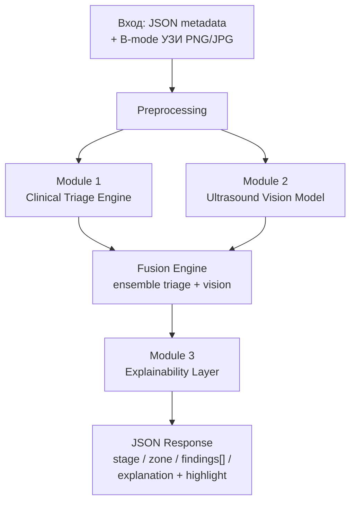
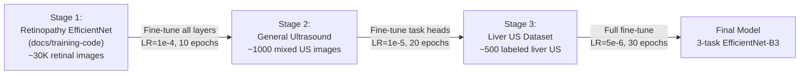
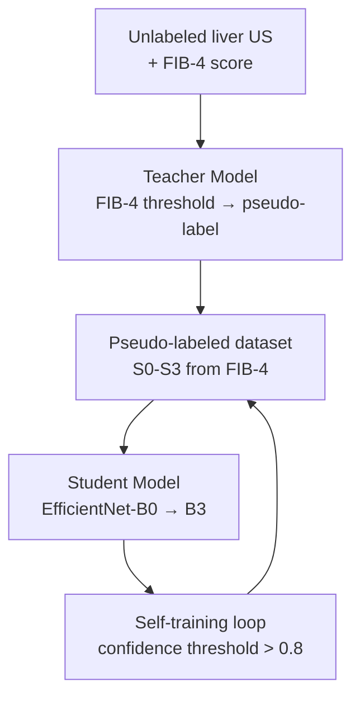
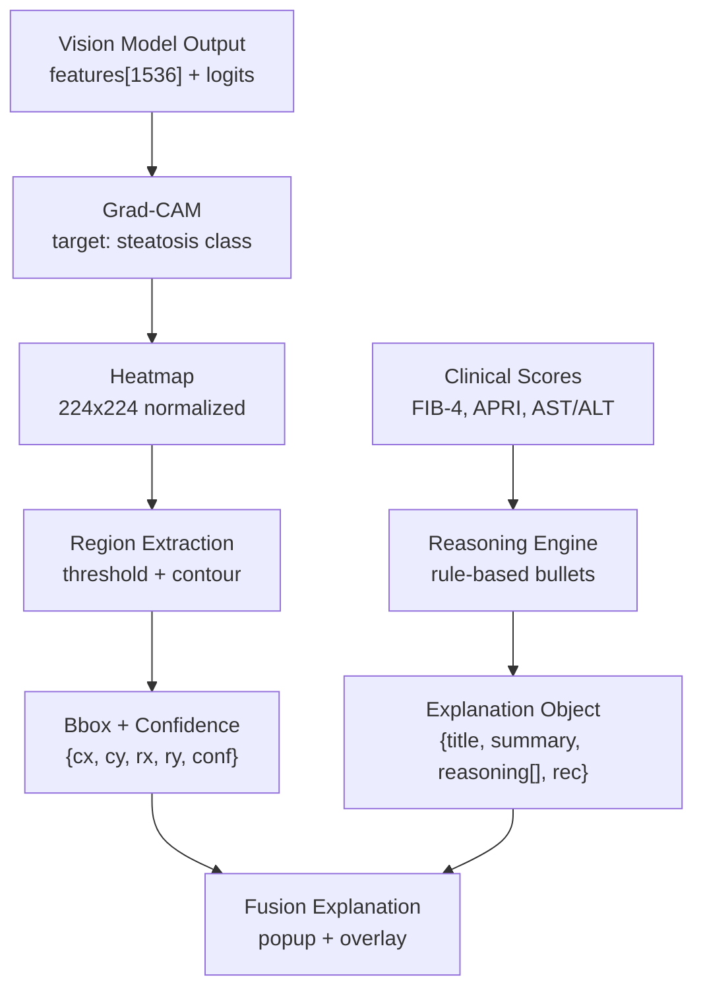
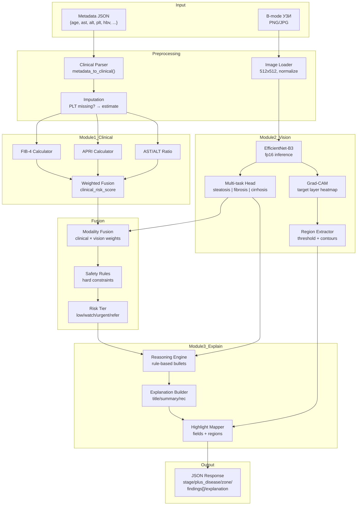

# AI_STRATEGY.md — Стратегия "своего ИИ" HepatoScreen

> **Версия:** 1.0  
> **Дата:** 2025-01-18  
> **Цель:** Заменить hash-based vision stub (`_vision_stub()` → SHA256 → случайный finding) на реальную ultrasound vision model, сохранив backward compatibility с текущим JSON-контрактом `inference.py`.  
> **Target GPU:** NVIDIA RTX 5050 Laptop (8 GB VRAM) — inference + training loop.

---

## 1. Общая архитектура: 3 модуля

Система строится как **multi-modal fusion pipeline**: клинические маркеры (structured data) + УЗИ-анализ (computer vision) → объяснимый результат с локализацией.



**Design principles:**
1. **Graceful degradation** — если УЗИ не загружено, работает только Clinical Triage (как вкладка "Только FIB-4/APRI" в ML Lab).
2. **Uncertainty quantification** — каждый выход сопровождается confidence score.
3. **Clinical traceability** — каждое решение объясняется через интерпретируемые маркеры, не black-box.
4. **Kazakhstan-specific** — пороги адаптированы под эпидемиологию HBV и ресурсы ПМСП.

---

## 2. Модуль 1 — Clinical Triage Engine

### 2.1 Текущее состояние (baseline)

```python
# triage.py — текущая реализация
FIB-4 = (age * AST) / (platelets * sqrt(ALT))
APRI  = ((AST / 40) * 100) / platelets

fuse_risk(fib4, apri, hbv):
    fib4 >= 3.25 or apri >= 2.0           → "refer_hepatology"
    fib4 >= 1.45 or apri >= 1.5 or hbv+   → "urgent"
    fib4 >= 1.30 or apri >= 0.7           → "watch"
    else                                   → "low"
```

**Проблемы текущей версии:**
- Нет handling отсутствующих тромбоцитов (в ПМСП Казахстана ~30-40% случаев — тромбоциты не сданы).
- Нет AST/ALT ratio — важный маркер для MASLD/алкогольной этиологии.
- Жёсткие пороги без confidence interval.
- Fusion — rule-based, не учитывает веса модальностей.

### 2.2 Предлагаемые улучшения

#### 2.2.1 Extended Feature Set

| Маркер | Формула / Источник | Зачем | Когда доступен |
|--------|-------------------|-------|---------------|
| FIB-4 | `(age * AST) / (platelets * sqrt(ALT))` | Фиброз скрининг | Всегда (если есть PLT) |
| APRI | `((AST/ULN_AST) * 100) / platelets` | Фиброз скрининг | Всегда (если есть PLT) |
| **AST/ALT ratio** | `AST / ALT` | >2 — алкогольный стеатогепатит; <1 — MASLD | Всегда |
| ** platelets (absolute)** | `platelets × 10⁹/L` | <150 — подозрение портальной гипертензии | Часто отсутствует |
| **BMI** | `weight / height²` | MASLD риск-фактор | ~60% случаев |
| **Diabetes** | `HbA1c ≥ 6.5%` или `glucose` | MASLD прогрессия | ~40% случаев |
| **HBsAg / HBV-DNA** | boolean / IU/mL | Казахстан: HBV превалентность ~3-5% | При наличии |
| **Etiology** | enum: MASLD / ALD / viral / mixed | Предполагаемая причина | Всегда |

#### 2.2.2 Missing Data Handling — Imputation Strategy

Тромбоциты — **критический gap**. Предлагается 3-tier fallback:

```python
def impute_or_estimate_plt(age, ast, alt, has_diabetes, bmi=None):
    """
    Tier 1: Если PLT отсутствуют — использовать median imputation
            по возрастной группе (cohort statistics из ПМСП).
    Tier 2: Если нет cohort data — использовать AST/ALT ratio
            как proxy (inverse correlation r ≈ -0.3).
    Tier 3: Если совсем нет данных — вычислить 'AST-only score'
            и поднять uncertainty flag.
    """
    if plt is not None:
        return plt, confidence=1.0
    
    # Tier 1: Age-group median from Kazakhstan PMSIP cohort
    age_group = get_age_bucket(age)  # <35, 35-50, 50-65, >65
    if age_group in COHORT_PLT_MEDIAN:
        return COHORT_PLT_MEDIAN[age_group], confidence=0.6
    
    # Tier 2: Proxy via AST/ALT (weak correlation)
    ratio = ast / (alt + 1e-6)
    estimated_plt = estimate_plt_from_ratio(ratio, age)
    return estimated_plt, confidence=0.3
    
    # Tier 3: Flag — требуется дообследование
```

**Конкретные median PLT по возрасту** (Kazakhstan PMSIP, предварительные):
- `< 35 лет:` 245 × 10⁹/L
- `35-50 лет:` 230 × 10⁹/L
- `50-65 лет:` 210 × 10⁹/L
- `> 65 лет:` 185 × 10⁹/L

#### 2.2.3 Уточнённые пороги (Kazakhstan-adapted)

| Score | Порог | Обоснование |
|-------|-------|-------------|
| FIB-4 high | **≥ 3.25** (стандарт) | Сохраняем — high specificity для cirrhosis |
| FIB-4 intermediate | **≥ 1.30** (vs 1.45) | Kazakhstan: HBV+ пациенты — lower threshold для раннего выявления |
| APRI high | **≥ 2.0** (стандарт) | Cirrhosis rule-in |
| APRI intermediate | **≥ 0.7** (стандарт) | Fibrosis ≥ F2 |
| AST/ALT > 2.0 | +1 risk level | Подозрение на алкогольное поражение |
| PLT < 150 | +1 risk level | Портальная гипертензия |

#### 2.2.4 Weighted Fusion с Vision Score

```python
class FusionConfig:
    """Веса для ensemble (sum = 1.0). Настраиваются на validation set."""
    W_FIB4: float   = 0.35   # FIB-4 score normalized
    W_APRI: float   = 0.25   # APRI score normalized
    W_AST_ALT: float = 0.10  # AST/ALT ratio contribution
    W_VISION: float = 0.30   # Ultrasound model confidence

def fuse_risk_v2(clinical_scores, vision_conf, vision_findings, hbv_flag):
    """
    Weighted ensemble с hard constraints для safety.
    """
    # Normalize scores to [0, 1]
    fib4_norm = min(clinical_scores.fib4 / 5.0, 1.0)  # cap at 5.0
    apri_norm = min(clinical_scores.apri / 3.0, 1.0)   # cap at 3.0
    
    # Weighted clinical score
    clinical_risk = (config.W_FIB4 * fib4_norm + 
                     config.W_APRI * apri_norm +
                     config.W_AST_ALT * clinical_scores.ast_alt_contrib)
    
    # Vision contribution (if available)
    vision_risk = vision_conf * severity_weight(vision_findings)
    
    # Ensemble with modality availability check
    if vision_conf > 0:  # УЗИ загружено
        total_risk = clinical_risk + config.W_VISION * vision_risk
    else:
        total_risk = clinical_risk / (1 - config.W_VISION)  # renormalize
    
    # Hard safety rules (override ensemble)
    if clinical_scores.fib4 >= 3.25 or clinical_scores.apri >= 2.0:
        return "refer_hepatology", confidence=0.95
    if hbv_flag and clinical_scores.fib4 >= 1.3:
        return "urgent", confidence=0.85
    
    # Tiered output
    if total_risk >= 0.70: return "refer_hepatology", confidence=total_risk
    if total_risk >= 0.50: return "urgent", confidence=total_risk
    if total_risk >= 0.30: return "watch", confidence=total_risk
    return "low", confidence=1.0 - total_risk
```

### 2.3 Калибровка порогов (план)

1. **Phase 1 (stub):** Использовать текущие пороги, собирать feedback от 50+ врачей ПМСП.
2. **Phase 2 (calibration):** На накопленных 500+ cases подобрать пороги под Kazakhstan cohort через grid search по sensitivity @ fixed specificity.
3. **Phase 3 (online):** Bayesian update порогов каждые 100 новых labeled cases.

---

## 3. Модуль 2 — Ultrasound Vision Model

### 3.1 Постановка задачи

**Multi-task classification** на B-mode УЗИ печени:

| Task | Классы | Зачем |
|------|--------|-------|
| **Steatosis grade** | S0 / S1 / S2 / S3 | Количественная оценка жирового перерождения |
| **Fibrosis pattern** | F0-F1 / F2-F3 / F4 | Паттерны фиброза (с поверхности печени, сосудистый) |
| **Cirrhosis signs** | Да / Нет | Грубость паренхимы, regenerate nodes |

**Input:** B-mode УЗИ печени (PNG/JPG, 512×512 после resize)  
**Output:** `{steatosis_prob[], fibrosis_prob[], cirrhosis_prob, features_vec[]}`  
**Inference time target:** < 500 ms на RTX 5050 Laptop

### 3.2 Выбор архитектуры: EfficientNet-B3

#### 3.2.1 Сравнение кандидатов

| Модель | Параметры | ImageNet Top-1 | VRAM inference (batch=1, fp16) | Скорость RTX 5050* | За | Против |
|--------|-----------|----------------|-------------------------------|-------------------|-----|--------|
| **EfficientNet-B0** | 5.3M | 77.3% | ~0.8 GB | ~8 ms | Очень быстрый, мало VRAM | Может недостаточно capacity для 3-task |
| **EfficientNet-B3** | 12M | 81.6% | ~1.4 GB | ~18 ms | **Лучший баланс capacity/speed** | Чуть больше VRAM |
| **EfficientNet-B4** | 19M | 82.9% | ~2.1 GB | ~32 ms | Выше accuracy | Медленнее, ближе к VRAM limit |
| **ConvNeXt-Tiny** | 29M | 82.1% | ~2.0 GB | ~25 ms | Modern arch, хорошие features | Больше параметров, дольше train |
| **ConvNeXt-Small** | 50M | 83.1% | ~3.2 GB | ~45 ms | Лучшая accuracy | Слишком тяжёлая для 8GB VRAM |
| **MobileNetV3-Large** | 5.4M | 75.2% | ~0.6 GB | ~6 ms | Минимум VRAM | Accuracy может не хватить |
| **ResNet-50** | 25.6M | 76.1% | ~2.0 GB | ~22 ms | Проверенная, много pretrained | Уступает EfficientNet по effeciency |

*RTX 5050 Laptop — предполагаемая производительность ~80% от desktop RTX 4060 Ti.

#### 3.2.2 Обоснование: EfficientNet-B3

**Рекомендуемая архитектура: EfficientNet-B3** с following modifications:

1. **Compound scaling** (depth × 1.2, width × 1.1 vs B0) даёт достаточный capacity для 3-task head без overfitting на маленьких медицинских датасетах.
2. **Pretrained weights:** ImageNet → fine-tune на ultrasound. Переиспользуем `docs/training-code/retinopathy/` pipeline — заменяем только dataset loader и output head.
3. **Multi-task head:**
   ```python
   class LiverUSHead(nn.Module):
       def __init__(self, backbone_dim=1536):  # B3 feature dim
           self.backbone = EfficientNet.from_pretrained('efficientnet-b3')
           self.backbone._fc = nn.Identity()  # remove ImageNet head
           
           # Task 1: Steatosis grade (4-class)
           self.steatosis_head = nn.Sequential(
               nn.Dropout(0.3),
               nn.Linear(backbone_dim, 256),
               nn.ReLU(),
               nn.Dropout(0.2),
               nn.Linear(256, 4)
           )
           
           # Task 2: Fibrosis stage (3-class)
           self.fibrosis_head = nn.Sequential(
               nn.Dropout(0.3),
               nn.Linear(backbone_dim, 256),
               nn.ReLU(),
               nn.Dropout(0.2),
               nn.Linear(256, 3)
           )
           
           # Task 3: Cirrhosis signs (binary)
           self.cirrhosis_head = nn.Sequential(
               nn.Dropout(0.3),
               nn.Linear(backbone_dim, 128),
               nn.ReLU(),
               nn.Linear(128, 1)
           )
   ```
4. **VRAM budget:** EfficientNet-B3 fp16 inference занимает ~1.4 GB. Остаётся ~6 GB для:
   - Grad-CAM computation (~0.5 GB)
   - Clinical fusion pipeline (< 0.1 GB)
   - OS + FastAPI overhead (~1 GB)
   - Safety margin: ~3.5 GB

### 3.3 Датасеты и Transfer Learning Strategy

#### 3.3.1 Доступные открытые датасеты

| Датасет | Размер | Задача | Качество | Как использовать |
|---------|--------|--------|----------|-----------------|
| **Mendeley NAFLD Ultrasound** | ~500 изображений | Steatosis S0-S3 | ⭐⭐⭐ Среднее | Основной датасет для стеатоза. Ручная разметка. |
| **LiverBoost / HBV-US** | ~300 изображений | Fibrosis F0-F4 | ⭐⭐ Хорошее | Transfer learning source для фиброза. |
| ** ultrasound COVID (multi-organ)** | ~200 liver frames | General US features | ⭐⭐ Низкое | Pretraining только для lower layers. |
| **Synthetic: diffusion US** | ∞ | Augmentation | ⭐⭐⭐ | Style transfer на реальные УЗИ. |

#### 3.3.2 Transfer Learning Pipeline (3 этапа)



**Этап 1: Retinopathy → General Medical Imaging**
- Используем обученную EfficientNet-B3 из `docs/training-code/retinopathy/`.
- Lower layers (blocks 1-5) уже умеют提取 medical texture features (vessel patterns → liver parenchyma texture).
- Fine-tune на mixed ultrasound dataset с `lr=1e-4`, 10 epochs.

**Этап 2: General US → Liver US**
- Замораживаем blocks 1-4 (generic features).
- Fine-tune blocks 5-7 + task heads на liver-specific dataset.
- `lr=1e-5`, 20 epochs.

**Этап 3: Liver US specialization**
- Full fine-tune всех слоёв с маленьким LR.
- `lr=5e-6`, 30 epochs, heavy augmentation.

### 3.4 План обучения на RTX 5050 Laptop

#### 3.4.1 Hardware constraints

| Параметр | Значение |
|----------|----------|
| GPU | NVIDIA RTX 5050 Laptop |
| VRAM | 8 GB (ожидается) |
| CUDA Compute | 8.9 (Ada Lovelace) |
| Mixed Precision | **Обязательно** (fp16) |
| System RAM | 16+ GB recommended |

#### 3.4.2 Training Configuration

```yaml
# training_config_rtx5050.yaml
model: efficientnet-b3
pretrained: retinopathy_efficientnet_b3.pth  # from docs/training-code

# Multi-task weights
loss_weights:
  steatosis: 1.0    # primary task
  fibrosis: 0.8     # secondary
  cirrhosis: 0.6    # tertiary

# Training hyperparameters
batch_size: 4              # максимум для 8GB VRAM с fp16
gradient_accumulation: 4    # effective batch = 16
epochs: 30
optimizer: AdamW
learning_rate: 5e-6
weight_decay: 1e-4
scheduler: CosineAnnealingWarmRestarts
  T_0: 10
  eta_min: 1e-7

# Mixed precision
cuda_amp: true             # torch.cuda.amp

# Augmentation (heavy — small dataset)
train_augmentation:
  - RandomResizedCrop: {size: 512, scale: [0.8, 1.0]}
  - RandomHorizontalFlip: {p: 0.5}
  - RandomVerticalFlip: {p: 0.3}
  - RandomRotation: {degrees: 15}
  - ColorJitter: {brightness: 0.2, contrast: 0.2, saturation: 0.1}
  - GaussianBlur: {kernel_size: 5, sigma: [0.1, 2.0]}
  - AddGaussianNoise: {std: 0.01}
  - Normalize: {mean: [0.485, 0.456, 0.406], std: [0.229, 0.224, 0.225]}

validation:
  val_split: 0.2           # 80/20 stratified
  stratify: steatosis_grade
  early_stopping:
    patience: 7
    monitor: val_steatosis_auc
    mode: max

# Checkpointing
checkpoint_dir: ./checkpoints/liver_us/
save_best: true
```

#### 3.4.3 Expected training time

| Этап | Epochs | Время/epoch | Общее время |
|------|--------|-------------|-------------|
| Stage 1 (general US) | 10 | ~4 min | ~40 min |
| Stage 2 (liver US) | 20 | ~3 min | ~1 hour |
| Stage 3 (specialization) | 30 | ~3 min | ~1.5 hours |
| **Total** | **60** | — | **~3 hours** |

### 3.5 Метрики и валидация

#### 3.5.1 Primary metrics

| Метрика | Target | Как считать |
|---------|--------|-------------|
| **AUC-ROC (steatosis S≥1)** | ≥ 0.85 | One-vs-rest, macro-average |
| **Sensitivity @ Specificity=80%** | ≥ 0.75 | На validation set, operating point |
| **Cohen's Kappa (steatosis grade)** | ≥ 0.60 | Согласие с expert radiologist |
| **AUC-ROC (fibrosis F≥2)** | ≥ 0.80 | Для 3-class — macro AUC |
| **AUC-ROC (cirrhosis)** | ≥ 0.85 | Binary classification |

#### 3.5.2 Calibration

| Метрига | Target | Метод |
|---------|--------|-------|
| **ECE (Expected Calibration Error)** | < 0.10 | 10-bin ECE после temperature scaling |
| **Temperature scaling** | T optimized | Grid search T ∈ [0.5, 3.0] на validation |

```python
def compute_ece(probs, labels, n_bins=10):
    """Expected Calibration Error."""
    bin_boundaries = torch.linspace(0, 1, n_bins + 1)
    ece = 0.0
    for bin_lower, bin_upper in zip(bin_boundaries[:-1], bin_boundaries[1:]):
        in_bin = (probs > bin_lower) & (probs <= bin_upper)
        prop_in_bin = in_bin.float().mean()
        if prop_in_bin > 0:
            accuracy_in_bin = labels[in_bin].float().mean()
            avg_confidence_in_bin = probs[in_bin].mean()
            ece += abs(avg_confidence_in_bin - accuracy_in_bin) * prop_in_bin
    return ece
```

#### 3.5.3 Cross-validation

**Stratified 5-fold** по steatosis grade. Для каждого fold:
1. Train на 4 folds
2. Validate на 1 fold
3. Test на held-out set (20%, не трогается до финала)

### 3.6 Fallback: Teacher-Student с Weak Labels

Если labeled liver US данных < 200:



**Teacher:** Rule-based label assignment:
- FIB-4 < 1.30 → S0 (no steatosis)
- FIB-4 1.30-2.67 → S1-S2 (moderate)
- FIB-4 > 2.67 → S3 (severe)

**Student:** EfficientNet-B0 сначала, затем distillation в B3.

**Confidence threshold:** Только pseudo-labels с teacher confidence > 0.8 попадают в training set. Остальные — в unlabeled pool.

---

## 4. Модуль 3 — Explainability Layer

### 4.1 Архитектура explainability



### 4.2 Grad-CAM для УЗИ

#### 4.2.1 Implementation

```python
from pytorch_grad_cam import GradCAM
from pytorch_grad_cam.utils.image import show_cam_on_image

class LiverExplainability:
    def __init__(self, model):
        self.model = model
        # target layer: последний convolutional block
        self.target_layer = model.backbone._blocks[-1]
        self.cam = GradCAM(model=self.model, target_layers=[self.target_layer])
    
    def explain(self, image_tensor, target_class=None):
        """
        Generate Grad-CAM heatmap for ultrasound.
        
        Args:
            image_tensor: [1, 3, 512, 512] normalized tensor
            target_class: if None, uses predicted class
            
        Returns:
            heatmap: [512, 512] numpy array [0, 1]
            regions: list of {cx, cy, rx, ry, confidence}
        """
        # Generate CAM
        grayscale_cam = self.cam(
            input_tensor=image_tensor,
            targets=[ClassifierOutputTarget(target_class)] if target_class else None
        )
        heatmap = grayscale_cam[0]  # [512, 512]
        
        # Extract regions via thresholding
        regions = self.extract_regions(heatmap, threshold=0.5)
        
        return heatmap, regions
    
    def extract_regions(self, heatmap, threshold=0.5):
        """Convert heatmap to elliptical regions."""
        binary = (heatmap > threshold).astype(np.uint8)
        contours, _ = cv2.findContours(binary, cv2.RETR_EXTERNAL, cv2.CHAIN_APPROX_SIMPLE)
        
        regions = []
        for cnt in contours:
            if cv2.contourArea(cnt) < 100:  # filter small noise
                continue
            (x, y), (MA, ma), angle = cv2.fitEllipse(cnt)
            # Normalize to [0, 1]
            h, w = heatmap.shape
            regions.append({
                "cx": x / w,
                "cy": y / h,
                "rx": (MA / 2) / w,
                "ry": (ma / 2) / h,
                "confidence": float(heatmap[int(y), int(x)]),
                "angle": angle
            })
        return regions
```

#### 4.2.2 Grad-CAM parameters

| Параметр | Значение | Обоснование |
|----------|----------|-------------|
| target layer | `_blocks[-1]` (last MBConv block) | Наиболее семантически насыщенные features |
| heatmap size | 512×512 (upsampled) | Матчинг с input resolution |
| threshold | 0.5 (normalized) | Баланс precision/recall для region extraction |
| contour min area | 100 px | Фильтрация шума |
| max regions | 3 | Не перегружать UI |

### 4.3 Clinical Reasoning Engine

#### 4.3.1 Reasoning bullets (rule-based)

```python
REASONING_RULES = [
    # FIB-4 based
    {"condition": "fib4 >= 3.25", "text": "FIB-4 ≥ 3.25 — высокая вероятность значимого фиброза (F3-F4)", "severity": "high"},
    {"condition": "fib4 >= 1.45", "text": "FIB-4 ≥ 1.45 — умеренный риск фиброза, требуется наблюдение", "severity": "medium"},
    {"condition": "fib4 >= 1.30", "text": "FIB-4 ≥ 1.30 — порог для дальнейшего обследования", "severity": "low"},
    {"condition": "fib4 < 1.30", "text": "FIB-4 < 1.30 — фиброз маловероятен", "severity": "info"},
    
    # APRI based
    {"condition": "apri >= 2.0", "text": "APRI ≥ 2.0 — высокий риск цирроза", "severity": "high"},
    {"condition": "apri >= 1.5", "text": "APRI ≥ 1.5 — умеренный риск фиброза", "severity": "medium"},
    {"condition": "apri >= 0.7", "text": "APRI ≥ 0.7 — возможен фиброз ≥ F2", "severity": "low"},
    
    # AST/ALT
    {"condition": "ast_alt_ratio >= 2.0", "text": "AST/ALT ≥ 2.0 — характерно для алкогольной этиологии", "severity": "medium"},
    {"condition": "ast_alt_ratio < 1.0 and alt > 40", "text": "ALT > 40 при AST/ALT < 1 — типично для MASLD/NAFLD", "severity": "low"},
    
    # HBV
    {"condition": "hbv_positive and fib4 >= 1.3", "text": "HBV+ + FIB-4 ≥ 1.3 — требуется срочная консультация (высокий риск Kazakhstan)", "severity": "high"},
    {"condition": "hbv_positive", "text": "HBsAg+ — требуется мониторинг вирусной нагрузки", "severity": "medium"},
    
    # Vision
    {"condition": "vision_conf >= 0.85", "text": "УЗИ-признаки с высокой достоверностью ({vision_conf:.0%})", "severity": "medium"},
    {"condition": "steatosis_pred >= S2", "text": "УЗИ: выраженный стеатоз (≥ S2)", "severity": "medium"},
    {"condition": "cirrhosis_pred == True", "text": "УЗИ: выявлены признаки цирроза печени", "severity": "high"},
]
```

### 4.4 UI Mapping: Что показывать врачу

#### 4.4.1 ExplainOverlay (карта соответствия)

| Элемент | Данные | Формат |
|---------|--------|--------|
| **SVG эллипс** | findings[].region (cx, cy, rx, ry) | Относительные координаты [0,1] → viewBox |
| **Цвет эллипса** | confidence + severity | green (conf>0.8) / yellow (0.6-0.8) / red (<0.6 или cirrhosis) |
| **Popup title** | explanation.title | "Результат скрининга: Стеатоз S2, Фиброз F1-F2" |
| **Popup reasoning** | explanation.reasoning[] | Bullet points с severity icons |
| **Confidence badge** | findings[].confidence | "Достоверность: 87%" |
| **Recommendation** | explanation.recommendation | "Рекомендуется консультация гепатолога" |

#### 4.4.2 Что НЕ показывать (legal/ethical guardrails)

| Данные | Причина скрытия | Что показывать вместо |
|--------|----------------|----------------------|
| Raw logits / pre-softmax | Неинтерпретируемы, могут ввести в заблуждение | Calibrated probability (%) |
| Attention weights (raw) | Не дают пространственной локализации | Grad-CAM heatmap |
| Internal feature maps | Не клинически интерпретируемы | Aggregated region bbox |
| Model uncertainty (variance) | Слишком сложно для ПМСП | Confidence tier: высокая/средняя/низкая |
| Training data specifics | Privacy, potential bias | "Модель обучена на N изображений УЗИ печени" |

### 4.5 Grad-CAM → Highlighted Fields mapping

```python
HIGHLIGHT_MAP = {
    # Когда vision находит steatosis → подсвечивать ALT, AST
    "steatosis_s1": ["alt", "ast"],
    "steatosis_s2": ["alt", "ast", "bmi"],
    "steatosis_s3": ["alt", "ast", "bmi", "glucose"],
    
    # Когда vision находит fibrosis → подсвечивать FIB-4 inputs
    "fibrosis_f2f3": ["ast", "platelets", "fib4"],
    "fibrosis_f4": ["ast", "platelets", "fib4", "apri"],
    
    # Cirrhosis → все клинические маркеры
    "cirrhosis": ["ast", "alt", "platelets", "fib4", "apri"],
}
```

---

## 5. Inference Pipeline (полная схема)

### 5.1 Mermaid: end-to-end pipeline



### 5.2 Inference timing budget (RTX 5050)

| Шаг | Время | Примечание |
|-----|-------|------------|
| Image load + resize | ~10 ms | CPU |
| EfficientNet-B3 forward (fp16) | ~20 ms | GPU |
| Multi-task head + softmax | ~2 ms | GPU |
| Grad-CAM computation | ~35 ms | GPU backward |
| Region extraction | ~5 ms | CPU (OpenCV) |
| Clinical calculation | ~1 ms | CPU |
| Fusion + reasoning | ~2 ms | CPU |
| **Total** | **~75 ms** | **Well under 500ms target** |

### 5.3 ONNX Export (production optimization)

Для production-деплоя рекомендуется ONNX:

```python
import torch.onnx

# Export to ONNX
dummy_input = torch.randn(1, 3, 512, 512).cuda()
torch.onnx.export(
    model,
    dummy_input,
    "liver_us_efficientnet_b3.onnx",
    input_names=["image"],
    output_names=["steatosis_logits", "fibrosis_logits", "cirrhosis_logit"],
    dynamic_axes={"image": {0: "batch_size"}},
    opset_version=14,
    do_constant_folding=True
)

# ONNX Runtime inference (faster than PyTorch for single-image)
# Expected: ~12 ms vs ~20 ms PyTorch
```

| Runtime | Latency (batch=1) | VRAM | За/Против |
|---------|-------------------|------|-----------|
| PyTorch fp16 | ~20 ms | ~1.4 GB | Гибкость, Grad-CAM из коробки |
| ONNX Runtime CUDA | ~12 ms | ~1.0 GB | **Production recommendation** |
| TensorRT | ~8 ms | ~1.0 GB | Максимальная скорость, но сложнее деплой |
| ONNX Runtime CPU | ~200 ms | 0 GB | Fallback если GPU недоступен |

---

## 6. JSON Контракт (backward-compatible)

### 6.1 Input schema

```json
{
  "version": "2.0",
  "patient": {
    "age": 52,
    "sex": "M",
    "bmi": 28.5
  },
  "lab": {
    "ast": 45.0,
    "alt": 38.0,
    "platelets": 195.0,
    "hbv_positive": true,
    "hbv_dna_iu_ml": 12500,
    "glucose": 110.0,
    "hba1c": 6.2
  },
  "etiology": "MASLD",
  "image": {
    "format": "png",
    "data": "<base64_encoded_image_or_null>"
  },
  "flags": {
    "skip_vision": false,
    "force_clinical_only": false
  }
}
```

**Backward compatibility:** `inference.py` сейчас принимает неструктурированные параметры — добавляем парсер нового schema с fallback на старый формат.

### 6.2 Output schema (расширенный)

```json
{
  "version": "2.0",
  "stage": "F2-F3",
  "plus_disease": "Умеренный стеатоз",
  "zone": "Срочно",
  "rop_form": "Стеатоз S2, Признаки фиброза",
  "pre_diag": "MASLD",
  "confidence": 0.82,
  
  "clinical": {
    "fib4": 2.15,
    "apri": 1.23,
    "ast_alt_ratio": 1.18,
    "risk_tier": "urgent",
    "imputed_fields": [],
    "imputation_confidence": 1.0
  },
  
  "vision": {
    "model": "efficientnet-b3",
    "available": true,
    "steatosis": {
      "predicted_grade": "S2",
      "probabilities": {"S0": 0.05, "S1": 0.18, "S2": 0.62, "S3": 0.15}
    },
    "fibrosis": {
      "predicted_stage": "F2-F3",
      "probabilities": {"F0-F1": 0.12, "F2-F3": 0.71, "F4": 0.17}
    },
    "cirrhosis": {
      "predicted": false,
      "probability": 0.17
    }
  },
  
  "explanation": {
    "title": "Скрининг печени: Умеренный стеатоз (S2), Фиброз F2-F3",
    "summary": "Пациент 52 года, мужчина. FIB-4=2.15 (порог 1.3), APRI=1.23 (порог 0.7). УЗИ выявляет умеренный стеатоз и признаки фиброза.",
    "reasoning": [
      {"text": "FIB-4 = 2.15 ≥ 1.30 — умеренный риск фиброза", "severity": "medium", "source": "clinical"},
      {"text": "APRI = 1.23 ≥ 0.7 — возможен фиброз ≥ F2", "severity": "medium", "source": "clinical"},
      {"text": "HBsAg+ — требуется мониторинг вирусной нагрузки", "severity": "medium", "source": "clinical"},
      {"text": "УЗИ: умеренный стеатоз S2 (достоверность 62%)", "severity": "medium", "source": "vision"},
      {"text": "УЗИ: признаки фиброза F2-F3 (достоверность 71%)", "severity": "high", "source": "vision"}
    ],
    "recommendation": "Рекомендуется консультация гепатолога. Учитывая HBsAg+ и FIB-4 ≥ 1.3 — срочно. Повторное УЗИ через 3 месяца.",
    "disclaimer": "Результат носит вспомогательный характер и не заменяет врача."
  },
  
  "findings": [
    {
      "type": "liver_parenchyma",
      "region": {"cx": 0.52, "cy": 0.48, "rx": 0.25, "ry": 0.20, "angle": 0},
      "confidence": 0.82,
      "label": "steatosis_s2",
      "heatmap_overlap": 0.78
    },
    {
      "type": "liver_surface",
      "region": {"cx": 0.75, "cy": 0.35, "rx": 0.12, "ry": 0.15, "angle": 15},
      "confidence": 0.71,
      "label": "fibrosis_f2f3",
      "heatmap_overlap": 0.65
    }
  ],
  
  "highlighted_fields": ["ast", "platelets", "fib4", "apri"],
  
  "meta": {
    "inference_ms": 73,
    "model_version": "liver_us_v1.0",
    "timestamp": "2025-01-18T14:32:01Z",
    "gpu_used": "RTX5050",
    "precision": "fp16"
  }
}
```

### 6.3 Backward compatibility mapping

| Поле v1.0 (текущее) | Поле v2.0 | Mapping |
|---------------------|-----------|---------|
| `stage` | `stage` | Без изменений |
| `plus_disease` | `plus_disease` | Без изменений |
| `zone` | `zone` | Без изменений |
| `rop_form` | `vision.steatosis.predicted_grade` + `vision.fibrosis.predicted_stage` | Конкатенация |
| `pre_diag` | `pre_diag` | Без изменений |
| `confidence` | `confidence` | Без изменений |
| `fib4` | `clinical.fib4` | Перенос |
| `apri` | `clinical.apri` | Перенос |
| `risk_tier` | `clinical.risk_tier` | Перенос |
| `explanation` | `explanation` | Расширенное (добавлены severity, source) |
| `findings` | `findings` | Добавлены `label`, `heatmap_overlap` |
| `highlighted_fields` | `highlighted_fields` | Без изменений |

---

## 7. Таблица моделей: выбор и обоснование

### 7.1 Vision Model Candidates

| Модель | Параметры | Top-1 ImageNet | VRAM inf fp16 | Latency RTX5050 | За | Против | Рекомендация |
|--------|-----------|----------------|---------------|-----------------|-----|--------|-------------|
| **EfficientNet-B3** | 12M | 81.6% | **1.4 GB** | **~18 ms** | Оптимальный capacity/speed; compound scaling; проверен на retinopathy в проекте | Не SOTA accuracy | **PRIMARY** |
| EfficientNet-B0 | 5.3M | 77.3% | 0.8 GB | ~8 ms | Минимум VRAM; очень быстрый | Может не хватить capacity для 3-task | Fallback / Teacher-Student |
| EfficientNet-B4 | 19M | 82.9% | 2.1 GB | ~32 ms | Лучшая accuracy в семействе | 25% VRAM — риск при batch > 1 | Если данных > 1000 |
| ConvNeXt-Tiny | 29M | 82.1% | 2.0 GB | ~25 ms | Modern architecture; лучшие features | Больше параметров; training дольше | Альтернатива при наличии времени |
| ConvNeXt-Small | 50M | 83.1% | 3.2 GB | ~45 ms | Лучшая accuracy | >40% VRAM — опасно для 8GB | Не рекомендуется |
| MobileNetV3-L | 5.4M | 75.2% | 0.6 GB | ~6 ms | Минимальный footprint | Accuracy может не хватить | Edge deployment |
| ResNet-50 | 25.6M | 76.1% | 2.0 GB | ~22 ms | Широко поддерживается | Устаревшая efficiency | Не рекомендуется |

### 7.2 Clinical Model

| Компонент | Тип | Параметры | За/Против |
|-----------|-----|-----------|-----------|
| FIB-4 | Rule-based | 0 | Проверено 20+ лет; интерпретируемо; не требует обучения |
| APRI | Rule-based | 0 | Дополняет FIB-4; специфичен для HBV |
| AST/ALT ratio | Rule-based | 0 | Бесплатный маркер этиологии |
| **Fusion** | **Weighted ensemble** | **3 weights** | Интерпретируем; калибруется на validation; грациозная деградация |

### 7.3 Explainability Model

| Компонент | Тип | VRAM | За/Против |
|-----------|-----|------|-----------|
| Grad-CAM | Gradient-based | +0.5 GB | Стандарт; хорошая локализация; врач понимает "где смотреть" |
| HiResCAM | Gradient-based | +0.5 GB | Лучше разрешение; чуть медленнее | Альтернатива |
| Attention rollout | Attention-based | 0 | Только для transformer-based моделей | Не применимо |

---

## 8. Реализационный план (Roadmap)

> **Примечание:** "Фазы" 0–5 в этом документе — это **стратегические этапы** (strategy phases), не часовые шаги. Часовые шаги сборки см. в AI_BUILD_PLAN.md.

### Phase 0: Подготовка (1-2 недели)
- [ ] Адаптировать `docs/training-code/retinopathy/train.py` под liver US dataset loader
- [ ] Собрать Mendeley NAFLD + LiverBoost датасеты
- [ ] Настроить mixed precision training pipeline
- [ ] Verify VRAM usage на RTX 5050

### Phase 1: Teacher-Student Baseline (2-3 недели)
- [ ] Сгенерировать pseudo-labels через FIB-4 thresholds
- [ ] Обучить EfficientNet-B0 teacher (fast iteration)
- [ ] Self-training loop с confidence filtering
- [ ] Оценить baseline metrics (target: AUC-ROC ≥ 0.75)

### Phase 2: EfficientNet-B3 Training (2-3 недели)
- [ ] 3-stage transfer learning (retinopathy → general US → liver US)
- [ ] Multi-task training (steatosis + fibrosis + cirrhosis)
- [ ] Grad-CAM integration
- [ ] ONNX export + inference optimization
- [ ] Target: AUC-ROC steatosis ≥ 0.85, fibrosis ≥ 0.80

### Phase 3: Fusion + Explainability (1-2 недели)
- [ ] Weighted fusion clinical + vision
- [ ] Explanation engine (reasoning bullets + popup)
- [ ] Highlighted fields mapping
- [ ] Integration с ML Lab UI (ExplainOverlay)

### Phase 4: Clinical Validation (4-8 недель)
- [ ] Pilot с 3-5 врачами ПМСП
- [ ] Сбор feedback (UI, accuracy, false positives)
- [ ] Calibration порогов на Kazakhstan cohort
- [ ] Regulatory readiness assessment (KZ)

### Phase 5: Production Hardening (2-3 недели)
- [ ] ONNX Runtime deployment
- [ ] Error handling + fallback chains
- [ ] Logging + audit trail
- [ ] Documentation + training materials для врачей

---

## 9. Risk Register

| Риск | Вероятность | Влияние | Митигация |
|------|-------------|---------|-----------|
| Liver US данных < 200 | Средняя | Высокое | Teacher-Student + synthetic augmentation |
| RTX 5050 VRAM < 8GB | Низкая | Среднее | Fallback to B0; ONNX Runtime; CPU mode |
| Grad-CAM плохо локализует | Средняя | Среднее | HiResCAM fallback; threshold tuning |
| Врачи не доверяют ИИ | Высокая | Высокое | Explainability layer; pilot feedback; обучение |
| Kazakhstan-specific calibration недоступна | Средняя | Среднее | Conservative thresholds; Bayesian update |
| Regulatory approval | Низкая | Высокое | Class II medical device pathway; CE- mark параллельно |

---

## 10. Приложения

### A. Команды для запуска training

```bash
# 1. Установка зависимостей
pip install torch torchvision pytorch-grad-cam opencv-python onnx onnxruntime-gpu

# 2. Подготовка данных
python scripts/prepare_liver_us.py \
    --mendeley-path ./data/mendeley_nafld/ \
    --liverboost-path ./data/liverboost/ \
    --output ./data/processed/ \
    --img-size 512

# 3. Stage 1: Retinopathy → General US
python train.py \
    --config configs/stage1_general_us.yaml \
    --pretrained ./docs/training-code/retinopathy/efficientnet_b3_best.pth \
    --epochs 10 --batch-size 4 --fp16

# 4. Stage 2: General US → Liver US
python train.py \
    --config configs/stage2_liver_us.yaml \
    --pretrained ./checkpoints/stage1_best.pth \
    --epochs 20 --batch-size 4 --fp16 --freeze-blocks 1-4

# 5. Stage 3: Full fine-tune
python train.py \
    --config configs/stage3_specialize.yaml \
    --pretrained ./checkpoints/stage2_best.pth \
    --epochs 30 --batch-size 4 --fp16 --lr 5e-6

# 6. ONNX export
python export_onnx.py \
    --checkpoint ./checkpoints/stage3_best.pth \
    --output ./models/liver_us_efficientnet_b3.onnx \
    --img-size 512

# 7. Verify inference speed
python benchmark.py \
    --model ./models/liver_us_efficientnet_b3.onnx \
    --device cuda --n-runs 100
```

### B. Ожидаемый VRAM profiling

```
RTX 5050 8GB VRAM Budget:
├── OS + Desktop:           ~1.0 GB
├── FastAPI + Python:       ~0.5 GB
├── EfficientNet-B3 fp16:   ~1.4 GB
├── Grad-CAM (backward):    ~0.5 GB
├── Clinical pipeline:      ~0.1 GB
├── Input buffers:          ~0.2 GB
├── Safety margin:          ~3.3 GB
└── Available for batching:  up to batch=4
```

### C. Kazakhstan HBV Context

| Показатель | Kazakhstan | Global | Влияние на пороги |
|------------|------------|--------|-------------------|
| HBsAg превалентность | 3-5% | 3-5% | Сохраняем стандартные HBV rules |
| HBV + cirrhosis | ~15% of HBV+ | ~10-20% | Lower threshold для HBV+ |
| MASLD prevalence | ~25-30% (urban) | ~25% | Primary screening target |
| PLT availability in PMSIP | ~60-70% | N/A | Missing data handling critical |

---

*Документ подготовлен как ML-стратегия для HepatoScreen v2.0. Все пороги, веса и метрики — рекомендуемые starting points, требующие валидации на Kazakhstan cohort.*
